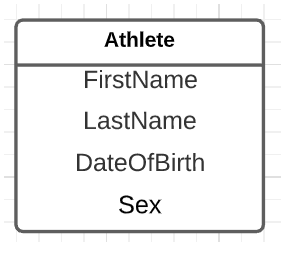

# University project

| **Name** | **Student Number** |
| ---| --- |
| Moumin Farah | 300026540 |
| André Marie Mishindu Kabeya | 300067899 |
| Joseph Nikuzabo | 300115712 |

 firstname | lastname | dateofbirth | sex
-----------|----------|-------------|-----
 Bob       | Test     | 1997-07-22  | M
 Bob2      | Test2    | 1998-07-22  | M
 Sab       | Test3    | 1999-07-22  | F


 

## Liverable1


### ER Diagram

The ER was created with [LucidChart](https://lucid.app)




### Ralational Diagram

The relational model was created with [LucidChart](https://lucid.app)


### Schema SQL

The database was created using Postgres. 
```
bash
> create database athlete;
```


The following sql will create the athlete schema

```sql
CREATE TABLE athlete(
  firstName varchar(50) ,
  lastName varchar(50) ,
  dateOfBirth date,
  sex char(1)
 );
```


### Exemple SQL

### INSERT

```
sql
INSERT INTO athlete (FirstName, LastName, DateOfBirth, Sex)

VALUES
	('Bob','Test','1997-07-22','M'),
        ('Bob2','Test2','1998-07-22','M'),
	('Sab','Test3','1999-07-22','F');
```

### UPDATE

```
sql
UPDATE athlete
SET lastname = 'Test1'
WHERE firstname='Bob';
```

```
sql
UPDATE athlete
SET firstName='Sabrina'
WHERE lastname='Test3';
```


### SELECT

```
sql
SELECT * FROM athlete;
```

```
sql
SELECT firstName FROM athlete;
```

```
sql
SELECT sex FROM athlete;
```

```
sql
SELECT dateofbirth FROM athlete 
    WHERE firstName='Bob';
```

### DELETE

```
sql
DELETE FROM athlete
WHERE lastname='Test3';
```

```
sql
DELETE FROM athlete
WHERE dateofbirth='1998-07-22';
```


